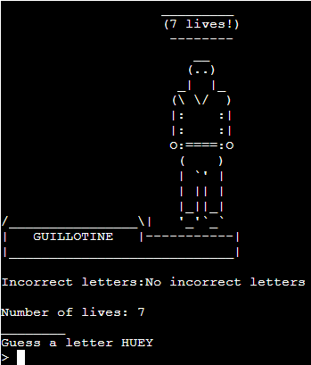

# Keep your head

# Goal for  this Project
Keep your head will be a hang man style game that will have a spin instead of the typical style of gallows, which will be replaced with a guillotine that will represent the player being executed if they fail to guess the correct word.

# Table of Contents
* [UX](#ux "UX")
    * [User Goals](#user-goals "User Goals")
    * [User Stories](#user-stories "User Stories")
    * [Site Owners Goals](#site-owners-goals)
    * [User Requirements and Expectations](#user-requirements-and-expectations)
         * [Requirements](#requirements)
         * [Expectations](#expectations)
    * [How to Play](#how-to-play)
    * [Design Choices](#design-choices)
    * [Images](#Images)
    * [Structure](#structure)
* [Features](#features)
        * [Existing Features](#existing-features)
        * [Features to be added in the future](#Features to be added in the future)
* [Technologies used](#technologies-used)
        * [Languages](#languages)
        * [Modules](#modules)
        * [Tools](#tools)
* [Testing](#testing)
        * [Testing on app](#testing-on-app)
        * [Code Validation](#code-validation)
        * [Bugs](#bugs)
        * [Unfixed Bugs](#unfixed-bugs)
    * [Deployment](#deployment)
    * [Credits](#credits)

# UX

## User Goals
* Visual progress of the guillotine being built.
* Know if they have successfully guessed the correct word.
* Know if they have failed to guessed the correct word.
* To know how many guesses the user has left.
* Clear instruction as to how to play the game

## User Stories
* As a user, I want to know the reult of the game.
* As a user, I want to know if a letter is repeated it counts as one input for to show the letters.
* As a user, I want to be able to replay the game without reloading the game.
* As a user, I want to be able to input a user name.
* As a user, I want to know how many guesses I have remaiing.
* As a user, I want to know the guesses that I have already inputted.
* As a user, I want visual representation of the guillotine.

## Site owners Goals
* To ensure that input is validated to give the only option for potential guesses ie letter, no numbers.
* For the guillotine to visual depict a guillotine being built.
* For a list of guesses that already being inputted.
* Give the user feedback on their performance.
* To give clear instructing on how to play the game.

## User Requirements and Expections

### Requirements
* To have a linear path in structure that is on a single page layout.
* Validation on input.
* List of guesess and remaining guesses.
* Feedback on if the user correctly guess the word and failure to guess the word.
* A visual guillotine

### Expections
* I expect to know if a wrong data input was entered. 
* I expect to be able to input a username.
* I expect to know if I lost my head or not.
* I expect to know how many guesess I have left.
* I expect to see my wrong guesses.

## How to PLay

* Keep Your Head is a guessing game that the player will have to guess the word that the game generates for them, resembling a hangman game with the exception of the gallows being a guillotine.
* The player will be given the choice to choose the length of the word based on the difficulty they choose.
    * Easy for a four letter word
    * Medium for a six letter word
    * Hard for a eight letter word
* Once the game starts, the player will be shown the base of the guillotine to show that game has started. The guillotine will be built upwards from the base given the player the chance to give seven incorrect letters before they lose their head, resulting in game over.
* The player will have 7 lives and it will be shown by a counter on how many the player has left.
* The player will win the game if they correctly guess the letter of the word.
* The player will lose the game if they run out of lives. 

## Design Choices

### Images

The images I used in my project were primarily text art. I accquired the Guillotine art from [ASCII Art Archive](https://www.asciiart.eu/weapons/guillotines "ASCII Art Archive") and edited the art down so it would build to its final form through 7 different incarnations of the build.  The reason I choose to use a guillotine was to keep with the theme of the French Revolution that will be linked to the words in the words.py file. I also used [fsymbols](https://fsymbols.com/generators/carty/) to generate a header for the name of the game Keep Your Head. The generated art that I choose was one that I felt was proportion to the size of that app where it wasn't overcasting the focus of the visual elements of the game and was easily readable. 

### Structure
The structure of the project was mapped out using [Lucid](https://www.lucidchart.com/pages/ "Lucid")

Flowchart for the logic to start the game.

Flowchart for the logic to play the game.

# Features

## Existing Features

Once the python3 run.py command has been entered into the terminal the first feature that will be shown is the text art for the logo of the game and input for the user to enter their name into.

* Game logo

* Input for name

The input of the name will aloud the games to refer to the user throughout the game.

* Example of name in input

* Examples of invalid inputs

* The first error for invaild input is for whitesspace in the images
* The second error for the invaild input is for numbers in the images
* The third error for the invaild input is for special characters

The input field only allows alphabetic characters

Once the user has entered their name in the input. The game will give a brief tutorial of the game and then ask the user to enter a letter that is based on the difficulty they wish to play.

* Tutorial for game

The inforamtion on how to play the game is to the point and brief, so the user can get what they need to play the game as quickly as possible.

* Different inputs that are required to choose difficulty

The E input will choose the easy difficulty that will generate four letter words from the api or up to 5 letter words from the words.py file.

The M input will choose the medium difficulty that will generate 6 letter words from the api or words between the length of 6 or 7 letters from the words.py file.

The H input will choose the hard difficulty that will generate 8 letter words from the api or words above 8 letters from the words.py file.

* Invalid input for difficulty

If a wrong input is entered it will repeat the the message asking for the difficulty

Once the the input for the difficulty of the game has been entered the game will begin. Based on the difficulty the user picked the only difference the user will see is the length of the word. Al other information will stay the same.

* Start of easy game

* Start of medium game

* Start of hard game

The start screen of the game will show the base of the platform with the executioner telling the user they have 7 lives, underneath the platform, it will show the incorrect letter the user has entered as it is the beginning of the game it will always show no incorrect letters, the number of lives being 7, the empty spaces for the game word and the text asking the user to enter as letter to guess.

* Correct guess input for word

When the user has correctly guessed a letter in the word it will print the letter in the empty spaces where it would be. If the word has multiples of the letter guessed it will print all letters of the guessed letter counting a one guess.

* Incorrect guess input for the word

When the user has incorrectly guessed a letter that is not in the word it will print the incorrect letter in the area for incorrect letters. It will also print a part of the guillotine and decrease the lives counter.

* Decrease lives counter

* Invalid inputs to guess input

* The first invalid error is for the input of a non letter to the terminal
* The second invalid error is for the input of two letter in the terminal
* The third invalid error is for a repeat guess for a letter that has already been inputted to the terminal

An valid input must be a single alpabetical letter that has not already been used.

* Guillotine

As above in the incorrect explanation, the guillotine will print each part when an incorrect guess has been made. This will demostrate to the user that they are losing lives and are on the verge of losing their head.

* The guillotine at the start of the game with 7 lives 

* The guillotine with 6 lives

* The guillotine with 5 lives

* The guillotine with 4 lives

* The guillotine with 3 lives

* The guillotine with 2 lives

* The guillotine with 1 lives

* Game Over Guillotine 

As the user loses lives the guillotine will gradually build. When the player has lost 4 lives the guillotine will be in its final form. With 5 lives lost the user will be placed in the guillotine. At 6 lives lost the executioner will raise his arm to pull on the draw rope. When the user loses all his lives the blade will be placed in the guillotine and x's on the user's eyes.

On losing the game the user will be shown a message saying they have lost their head and show the game word.

* Losing Message

If the user correctly guessed the letter's of the word it will tell the user they have won and show the game word.

* Winning Message

Once the game has ended the user will be asked if they would like to play again or close the program. To play agin the user must enter Y and to cloce the program the user must enter N. If the user choose Y the game will begin again where it ask the user to enter their name. If the user choose N the game will thank the user for playing and close the program

* Play again message

* Yes to play again

* No to play again

## Features to be added in the future

* Add the name of the user in the platform of the guillotine
* Add more words to the words.py file
* Add multiplayer option

# Technologies Used

## Languages

* [JavaScript](https://en.wikipedia.org/wiki/JavaScript "JS") was built into the template supplied by Code Institute
* [Python](https://en.wikipedia.org/wiki/Python_(programming_language) "Python") for the game code
* [Markdown](https://en.wikipedia.org/wiki/Markdown) for the content in my README file

## Modules

* For selcting a random word from my list variables [Random](https://www.geeksforgeeks.org/python-random-module/)
* To give the user the option to close the program [SYS](https://www.geeksforgeeks.org/python-sys-module/)
* To pull the requested Api for the words used in the game [Requests](https://www.w3schools.com/python/module_requests.asp)

## Tools

* For construction [Gitpod](https://www.gitpod.io/ "Gitpod")
* For python validation [PEP8 online](https://pep8ci.herokuapp.com/ "PEP8")
* For spell checking [Grammarly](https://chrome.google.com/webstore/detail/grammarly-for-chrome/kbfnbcaeplbcioakkpcpgfkobkghlhen/related?hl=en "Grammarly")
* For the word API [Random word API](https://random-word-api.herokuapp.com/home "Random Word API")
* For the guillotine art [ASCII Art Archive](https://www.asciiart.eu/weapons/guillotines "ASCII Art Archive")
* For the heading art of Keep Your head[fsymbols](https://fsymbols.com/generators/carty/ "fsymbols")
* For creating flowchart for logic of project [Lucid](https://www.lucidchart.com/pages/ "Lucid")

# Testing

## Testing on app

From testing the game throughout the build process there were many changes that were made to the final outcome of the game. The major change that went through different methods of function was how to game pulled the words for the game. The original method that I used at the beginning was I installed the NLTK and downloaded the word library. I quickly change this method mainly because every time I would open up my GitPod workspace the library was not still installed so I would have to repeat the process of installing the library. Next, I decided to create a variable that held a list of words that were connected to the French revolution to connect to the guillotine theme. I then was going to create a function that was going to determine the length of the word and then return the word if it was equal to the input of the difficulty. I had trouble building this function and was given the advice to use the Random Word API generator. When I got around to building the function that requests the API's URL, the app was down due to Heroku's change in its policy that recently happened. With this change, I decided to create three different variables from the list variable that I already created and made three lists based on the difficulty of the words so It could be called upon by the input of the difficulty. With this made, I was able to get my words for my game. I was then informed within a week of the due date for my project that the API was active again so I decided to proceed with the API root but keep the three list variables as a backup by creating a function that checks if the source code is equal to 503 it will use the get difficulty words from the words.py file.

Another change that was made from testing was I had to change the sizing of the guillotine pictures due to the top of the guillotine being cut off when displayed in the Heroku app. This was done by editing the height of the picture by deleting lines of text. Luckily this didn't affect the original output of the guillotine. The only difference it being in smaller in scale with none of its main attractions missing.

As I continued the testing of the game, I felt that there weren't enough lives for the user to have when on hard difficulty. To fix this  I added 1 more picture to the guillotine list so the number of lives could be increased to 7. This would have the player be able to have given extra lives on lower difficulty making it easier for those difficulties and also making the hard difficulty not extremely hard and impossible to win.

## Code Validation

Using the [PEP8ci](https://pep8ci.herokuapp.com/) code validator for the python code I received no errors. I think the reason for this was mainly due to using the extension Error Lens to correct any invalid code when building the project.

## Bugs

I found several bugs when building my project.

* On printing the guillotine text art it would split the pictures where there are \ the way I fixed this war placing a r before the quotation marks.

* On printing the incorrect letters in the area for incorrect letters it would print vertical on top of each other, to fixes this I added end='' so if would print left to right in a row

* When playing the game if the player had 2 lives left it would print the game over the guillotine picture and then on the next input of a letter it would repeat the picture without informing the player they had lost. If the next guess was a correct letter it would print the letter. If it was an incorrect letter it would crash the game. This was happening because it was counting the first guillotine as an incorrect letter/Life. To fix this, I put a -1 on the length of the guillotine pictures to the length of incorrect letters, so it wouldn't count as the first picture.

* When I added an extra picture to the guillotine list I didn't count the picture due to I forgetting to put a comma to seperate the picture. This would make the game end when the player still had one life left.

* When checking if the input was valid for the difficulty. If the user enters an invalid input it would repeat the error message in a loop. This was due to the while loop nothing having another value to reference from which was fixed by placing the input variable in the while loop. 

## Unfixed Bugs

* There are no known unfixed bugs.

# Deployment

The site was deployed via Heroku. Here is the link [Keep Your Head](https://keep-your-head.herokuapp.com/ "link")

The project repository was created using the *Code-Institute-Org/python-essentials-template* on GitHub

### Create a GitHub Repo and GitPod

* Vist [GitHub](https://github.com/ "GitHub")
* Sign into GitHub account
* On dashboard, select **Repositories** and then **New**
* Select Code-Institute-Ord/python-essentials-template
* Enter Repository Name in text box 
* Add description in text box
* Select Public
* Select **Create repository**
* Wait for repository to generate
* Select **GitPod"" on repo dashboard
* Wait for Gitpod workspace to be built
* Once GitPod workspace is built make your initial commit

### Deployment via Heroku

* Visit [heroku.com](https://www.heroku.com/home "Heroku")
* Sign into Heroku account
* From the dashboard, select **New** and then **Create new app**
* Enter an app name into the text box, select a region from the dropdown and then press **Create app**
* A Heroku app has now been created and the **Deploy** tab is opened
* Select the **Settings** tab
* Click on the **Reveal Config Vars** button
* In the textbox with KEY as the placeholder, enter *PORT*
* In the textbox with VALUE as the placeholder, enter *8000*
* press **Add**
* In the buildpacks section of the settings tab, click on **Add Buildpack**, select **python** and then save changes
* Click on **Add Buildpack** again, select **node.js** and then save changes
* When they are on the dashboard, ensure that python is above node.js on the list
* Open the **Deploy** tab
* * In the deployment method section, select **GitHub** and confirm the connection.
* Enter the repo-name into the text box and click **Search**. When the correct repo appears below, click **Connect**
* In the Automatic deploys section, click **Enable Automatic Deploys**. This updates every time GitHub code is pushed
* To complete the process click on the **Deploy Brach** button in the Manual deploy section, this will take a few seconds to complete while Heroku builds the app
* A message will appear informing you that the app was successfully deployed and a **View** button will bring you to the live site

# Credits 

* Scott from CI Tutor support
* [Shaun Halverson](https://www.youtube.com/watch?v=pFvSb7cb_Us&t=795s&ab_channel=ShaunHalverson)